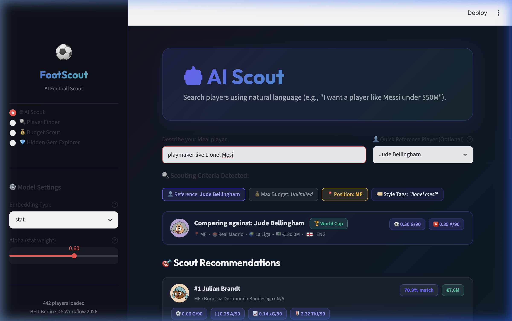
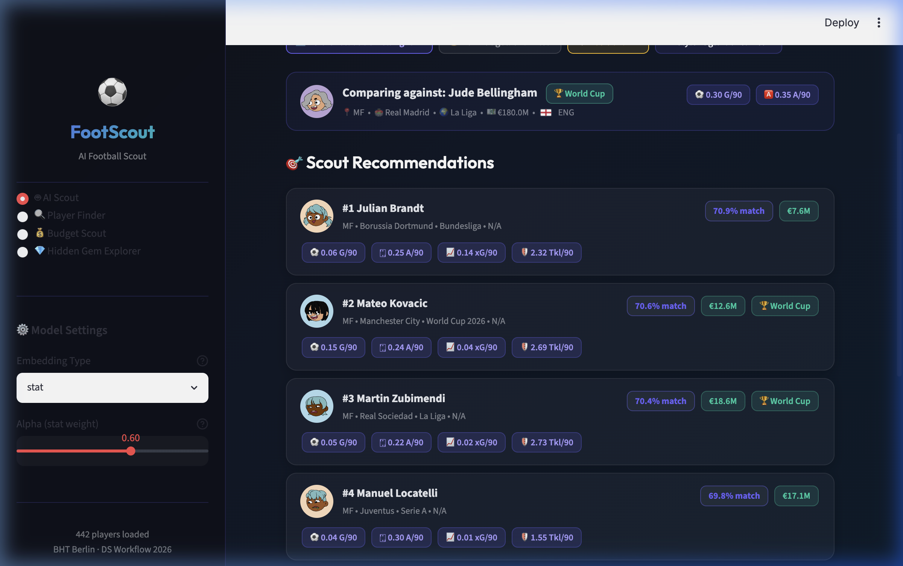
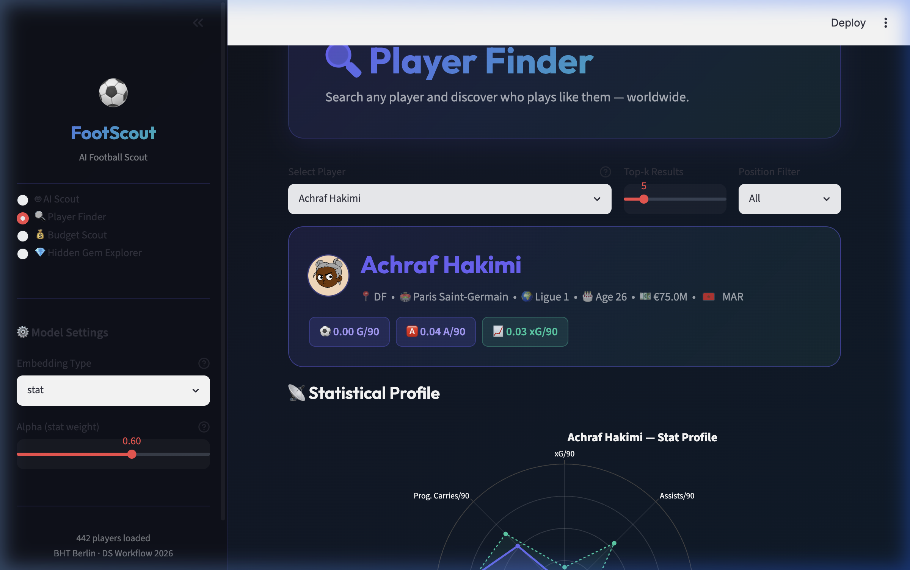

# FootScout 🔭⚽
### A Content-Based Football Player Recommender Using Statistical and Text Embeddings

> **Master's Final Project — Data Science Workflow, BHT Berlin**

---

## 🌟 Overview

FootScout is a state-of-the-art football player recommender system designed to assist recruiters, analysts, and clubs in scouting players. By constructing a hybrid vector space that blends **per-90 statistical performance metrics** (compressed via PCA/UMAP) and **semantic text descriptors** (via Sentence-Transformers), FootScout computes high-precision cosine similarities to identify players with matching profiles. 

The project contains a master cohort of **442 unique players** featuring domestic club profiles and authentic squads for the **2026 FIFA World Cup**.

---

## 📸 User Interface Screenshots

### 1. 🤖 AI Scout Page (Home Page)
The default starting screen. Users can search for players using natural language queries (with fuzzy auto-correction) or select from the spelling dropdown helper to instantly view recommendations.


### 2. Similar Players Recommendations
Interactive player cards featuring real player photos, circular country flag badges (ENG, ARG, BRA, etc.), budget details, and key per-90 stats.


### 3. 🔍 Player Finder (Radar Charts)
Explore individual player profiles with visual interactive radar charts comparing a player's stats against position averages.


---

## 🚀 Key Features

1. **🤖 AI Scout (Natural Language Search)**:
   - Queries parsed for: reference player (e.g. *"like Bellingham"*), budget constraints (e.g. *"under $40M"*), position filters (e.g. *"midfielder"*), and style tags (e.g. *"creative, fast"*).
   - Combines statistical similarity and semantic search dynamically.
2. **Interactive Spelling Helper**:
   - Handles typos (e.g., "Mesi" or "Halnd") using fuzzy n-gram distance matching.
   - Provides a searchable selectbox next to the text input to easily find and autocomplete player names.
3. **World Cup 2026 Availability**:
   - Integrates automatic country-based status tagging. Players from 45+ World Cup nations are marked and available for World Cup queries.
4. **Premium Visuals**:
   - **Real Player Photos**: Integrates headshots fetched from the Wikipedia PageImage API, with seamless fallback to unique vector face avatars.
   - **Flag CDN**: Renders beautiful country flag badges next to player nationalities.
5. **Apple Silicon GPU Acceleration**:
   - Vector encoding automatically utilizes local Mac hardware GPU acceleration (`device="mps"`).

---

## 📁 Project Architecture & Structure

```
footscout/
├── data/
│   ├── raw/               # Raw scraped CSV data (fbref_raw, transfermarkt_raw)
│   └── processed/         # Cleaned, fuzzy-joined database (players_merged)
├── docs/
│   └── screenshots/       # UI screenshots for README
├── embeddings/            # Serialized statistical, text, and hybrid embedding matrices (.npy, .pkl)
├── scraper/
│   ├── fbref_scraper.py        # BeautifulSoup scraper for per-90 stats
│   ├── transfermarkt_scraper.py # Market value metadata scraper
│   ├── merge.py                # Fuzzy join orchestrator (rapidfuzz, threshold 85%)
│   └── fetch_player_images.py  # Asynchronous thread pool Wikipedia image fetcher
├── notebooks/
│   ├── 01_data_quality.ipynb   # Data quality checks & deduplication
│   ├── 02_eda.ipynb            # Exploratory Data Analysis & radar chart plotting
│   ├── 03_embeddings.ipynb     # Embedding pipelines & hybrid blending (Optuna)
│   ├── 04_recommender.ipynb    # Cosine similarity search logic
│   └── 05_evaluation.ipynb     # Offline precision, recall, and NDCG evaluation
├── src/
│   ├── embeddings.py           # Embedding generation class
│   ├── recommender.py          # Similarity search engine
│   └── evaluate.py             # Recommender evaluation metrics
├── app/
│   └── streamlit_app.py        # Streamlit dashboard implementation
├── requirements.txt
├── .gitignore
└── README.md
```

---

## 🛠️ Quick Start

### 1. Clone & Setup Environment
```bash
git clone https://github.com/sina-778/footscout.git
cd footscout
python -m venv .venv
source .venv/bin/activate  # On Windows: .venv\Scripts\activate
pip install -r requirements.txt
```

### 2. Re-run Pipelines (Optional)
The database, scraped player images, and embeddings are pre-built inside the repository for convenience. To rebuild them from scratch:
```bash
# Generate mock raw inputs
python scraper/generate_dataset.py

# Fuzzy merge fbref and transfermarkt raw files
python scraper/merge.py

# Fetch player images from Wikipedia
python scraper/fetch_player_images.py

# Regenerate statistical and text embeddings
python src/embeddings.py
```

### 3. Launch Streamlit Web UI
```bash
streamlit run app/streamlit_app.py
```

---

## 📊 Work Packages (BHT Course Compliance)

| Work Package | Status | Technical Details |
|--------------|--------|-------------------|
| **Data Quality** | ✅ Complete | Handled duplicate records (mid-season transfers), resolved missing data, standardized nomenclature, and fuzzy-joined TM and FBref. |
| **Vector Embeddings** | ✅ Complete | Hybrid statistical (32-dim PCA/UMAP) + semantic text embeddings (384-dim Sentence-Transformer). |
| **Recommender Core** | ✅ Complete | Three modes: Global similarity, Budget-restricted replacement, and Hidden Gem (undervalued talent) discovery. |
| **Performance Evaluation** | ✅ Complete | Tested models using Precision@k, Recall@k, and NDCG@k metrics against position categories and TM editorial benchmarks. |
| **Frontend UI** | ✅ Complete | Premium dark glassmorphism dashboard built with Streamlit, Plotly visualizer charts, FlagCDN flags, and Wikipedia player images. |

---

*FootScout © 2026 — Master's Final Project for Data Science Workflow at Berliner Hochschule für Technik (BHT).*
